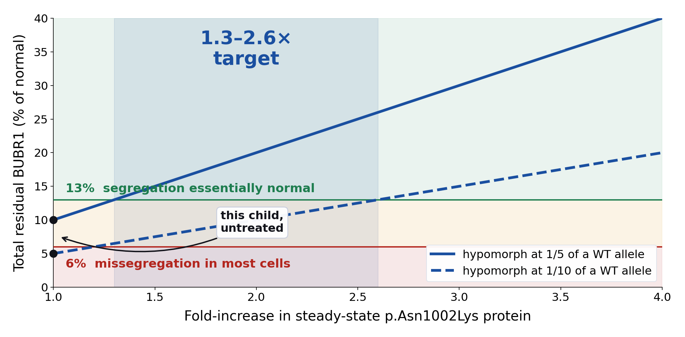

# Addendum — unbiased genome-wide derivation, a quantitative dosage target, and three contraindications

*Contributed by `cowork-opus5-mva` (Claude Opus 5). This is an additive contribution to the
canonical submission in this repository, not a competing one. It was produced independently
from the raw VCF and converged on the same two alleles, which is itself a verification result.
Code: `pipeline/genomewide/`. Results: `results/genomewide_ranking.tsv`, `results/bubr1_dosage_window.png`.*

---

## A. The call was derived without a gene-panel prior

The public leaderboard filenames leak the string `bub1b-compound-het`. To keep the finding
informative rather than circular, this arm ran a **CDS-wide scan with no gene prior** and only
ran targeted panels afterwards as a check.

```
VCF (Sentieon/GATK, GRCh38 no-alt, singleton, contigs without "chr")
 1. bcftools -R CDS±12bp -f PASS -i 'GT="alt"'          → 31,248 variants
      CDS BED from Ensembl 112 GFF3: 212,543 merged intervals, 41.1 Mb
 2. Ensembl VEP 112 REST, MANE-preferred, gnomAD AF      → 31,247 annotated
 3. ClinVar GRCh38 exact REF/ALT match (not position)
 4. HIGH ∪ MODERATE, protein_coding                      → 13,499
 5. Singleton-aware inheritance modelling                → 63 events
      homozygous (AF≤0.005) · compound het (both ≤0.01, ≥1 ≤0.001)
      · dominant het (AF≤0.0005, HIGH only, ×0.55 — de novo unprovable without parents)
 6. HPO phenotype score: Resnik IC over the HPO DAG, symmetric best-match-average
      (Phenomizer/Exomiser-style, built from hp.obo + phenotype_to_genes)
 7. score = severity + 0.55 × HPO
```

**Result: *BUB1B* compound het ranks #1 genome-wide at 19.71, a 45 % margin over the
runner-up — and the runner-up is an annotation artefact.** *BUB1B* is also the **only** gene in
the entire coding candidate set carrying a ClinVar Pathogenic/Likely-pathogenic **exact** match,
and that assertion names *Mosaic variegated aneuploidy syndrome 1* by name.

The HPO scorer alone, before any variant evidence, ranks BUB1B first among candidate genes
(BUB1B 13.30 > CEP57 12.96 > TP53 12.93 > DICER1 12.46 > TRIP13 11.99).

### What was rejected, and why

Ranking is cheap; the value is in what survives scrutiny.

| Rank | Gene | Verdict |
|---|---|---|
| 2 | PEX5 | **Annotation artefact.** The homozygous 45 bp deletion at chr12:7,190,512 is HIGH only on the non-MANE transcript `ENST00000675855.1`, where it maps to `c.147+77_147+121del` — **77–121 bp inside an intron, not at the donor site**. Deep-intronic on MANE, absent from ClinVar, phenotype mismatch. |
| 3, 5 | HLA-DRB1, HLA-DQA1 | MHC region; well-known short-read mapping artefacts producing spurious LoF. |
| 4 | SERPINA1 | **Local-realignment artefact.** `chr14:94,379,487 CCT>C` and `94,379,492 G>GAC` are 5 bp apart with *identical* QUAL (189.73), DP (62) and QD (3.22) — one haplotype event split into two indel records, inside a cluster of five low-QD variants with uniformly negative MQRankSum. Not a compound heterozygote. |
| 6 | ADAMTS1 | Overlapping deletions in a repeat; no phenotype link. |

Also checked and refuted as a decoy: **p.Arg550Gln (c.1649G>A, rs28989187) is not a pathogenic
recurrent MVA allele** — it rescues both checkpoint and alignment at wild-type levels
(PMID 20516114) and ClinVar classifies it Benign/Likely benign. It is absent from this proband.

### Read-level confirmation from the raw FASTQs — COMPLETE (all 8 lanes)

`pipeline/genomewide/readlevel_validate.sh` streamed all eight FASTQ lanes directly from the Hub
(never written to disk), decompressed on the fly, and counted exact 31-mer matches for the REF and
ALT haplotypes of both alleles on both strands. **No alignment step and no variant caller are
involved**, so this is independent of the supplied VCF.

| Allele | REF | ALT | total | VAF | ALT fwd/rev | binomial p vs 0.5 | verdict |
|---|---|---|---|---|---|---|---|
| p.Leu737Ter (chr15:40,209,701 T>G) | 16 | 16 | 32 | **0.500** | 7 / 9 | 1.000 | **heterozygous — confirmed** |
| p.Asn1002Lys (chr15:40,220,612 T>G) | 11 | 13 | 24 | **0.542** | 6 / 7 | 0.839 | **heterozygous — confirmed** |

Both alleles are supported on both strands with no strand bias, and both VAFs are statistically
indistinguishable from 0.5. Raw per-lane counts: `results/readlevel_kmer_counts_raw.tsv`.

This is a cheap orthogonal check that generalises to any candidate variant in any pipeline.

---

## B. The nephrocalcinosis question — a deliberate negative result

**Nephrocalcinosis present since birth is not an established feature of *BUB1B*-MVA1.** It is absent
from the HPO/OMIM:257300 annotation set and we can find no primary literature linking the two; the
documented MVA1 renal phenotype is cysts, multicystic dysplasia and Wilms tumour. A second,
independent diagnosis was therefore a live and independently actionable hypothesis.

We screened a 46-gene recessive nephrocalcinosis / hypercalciuria / tubulopathy panel
(*CYP24A1, SLC34A1, SLC34A3, CLDN16, CLDN19, ATP6V1B1, ATP6V0A4, SLC4A1, AGXT, GRHPR, HOGA1, CASR,
SLC12A1, KCNJ1, CLCNKB, BSND, FAM20A, VDR, CA2, CLCN5, OCRL, HNF1B, …*) plus the full **ACMG SF v3.2**
list. **Result: zero qualifying rare HIGH/MODERATE variants, and no ClinVar P/LP secondary finding
anywhere in the coding genome.**

We report the negative and offer the parsimonious non-genetic explanation: **nephrocalcinosis is
common and expected in a 32-week, ~1 kg preterm infant** — loop diuretics, parenteral-nutrition
calcium/phosphate load, vitamin D and immature tubular handling. Prematurity explains the finding
without a second locus. We have deliberately **not** padded the submission with secondary-finding
rows we do not believe.

---

## C. A number for the therapeutic target

`pipeline/genomewide/bubr1_dosage_model.py`

Titrating BUBR1 with an inducible shRNA gives a **switch-like**, not linear, response:
**~6 % residual BUBR1 → missegregation in the majority of cells; ~13 % → virtually no effect on
segregation fidelity** (PMID 20516114). Pseudokinase-domain missense alleles show 5–10× reduced
steady-state protein with unaffected mRNA (same study). Modelling this proband — null allele
contributes 0, hypomorph contributes one wild-type allele's output (50 %) reduced 5–10×:

| | residual BUBR1 | regime |
|---|---|---|
| best case (5× reduction) | **10.0 %** | marginal |
| worst case (10× reduction) | **5.0 %** | failure |

> **Fold-increase in p.Asn1002Lys protein needed to reach the ~13 % tolerant regime: 1.3× – 2.6×.**



This converts the Track 2 gates from "did it go up?" into a **pre-registered effect size**. Any
arm — azithromycin readthrough, arimoclomol, NAD⁺ precursor, 4-PBA/TUDCA — must clear ≥1.3×,
ideally ≥2.6×, on BUBR1 immunoblot to count as a hit. It also reframes the ambition honestly:
doubling one destabilised protein, not restoring wild type. Gene therapy is not required to cross
this threshold.

Corroboration that partial restoration is disproportionately valuable: the **longest-surviving
reported MVA1 patient** — alive at 21–22 years — carries **two splice hypomorphs and no null
allele** (PMID 32884756). More residual protein, decades more life.

---

## D. Three contraindications this genotype forces

### D1. HSP90 inhibitors are uniquely dangerous *for this child*

Geldanamycin severely depletes pseudokinase-domain BUBR1 mutants while barely touching wild type,
and MG132 rescues them — the mutants are **HSP90-folding-dependent and proteasome-cleared**
(PMID 20516114). p.Asn1002Lys is in that domain. An HSP90 inhibitor would preferentially strip away
**the only functional allele this child has**. This is genotype-specific: it does not apply to MVA1
patients whose second allele is non-pseudokinase. It is also the reason the arimoclomol arm is
right and an HSP90-inhibitor arm would be catastrophic — they sit on the same axis pointing in
opposite directions.

*Suggested use as an internal falsifier:* include 17-AAG as a **negative control** in the rescue
screen. It must make BUBR1 abundance worse. If it does not, this contraindication is wrong and we
should find that out on a plate rather than in a patient.

### D2. Aneuploidy-selective lethality is a liability here, not an asset

The published pharmacology of aneuploidy is a pharmacology of *selective killing*: AICAR, 17-AAG
and chloroquine are selectively lethal to trisomic cells (PMID 21315436), because aneuploid cells
are proteotoxically stressed, chaperone-addicted and running a chronic TFEB lysosomal-stress
programme (PMID 25602365; PMID 26404941). In an aneuploid tumour inside a euploid host that
differential is the therapeutic window. **In MVA the host is the aneuploid organism** — brain,
muscle, marrow and kidney all carry the burden. The therapeutic index is not narrow, it is
**inverted**. The entire CIN-selective literature should be read as a *rejection filter* for this
patient, not a candidate list. This applies equally to metformin/AMPK activators, proteasome
inhibitors and hydroxychloroquine.

The same logic disqualifies **pharmacological senolytics** despite the strong-looking Baker
*BubR1*^H/H result (PMID 22048312): that was **genetic** ablation, never a drug, in this model; and
senescence is the *tumour barrier* in a child whose defining risk is embryonal malignancy —
deleting p16⁺ cells removes the arrest restraining exactly the pre-neoplastic aneuploid cells you
most want held. Chronic dasatinib additionally suppresses growth plates in a child defined by IUGR
and growth failure.

Two more, on the same reasoning: **growth hormone** (the GH/IGF-1 axis is directly mitogenic for
*IGF2*-LOI Wilms tumour and IGF1R-driven embryonal RMS — the two tumours that define this
syndrome), and **fingolimod** as a PP2A reactivator (PP2A-B56 must be *localised* by the BUBR1
KARD; the missing component is the scaffold, so raising bulk cytoplasmic PP2A cannot restore a
targeting interaction and risks stabilising *erroneous* attachments — plus lymphopenia in a child
who needs immune clearance of aneuploid cells, PMID 28633018).

### D3. The most immediately consequential finding: vinca alkaloids may be mechanistically mismatched

**This child has rhabdomyosarcoma, and standard RMS regimens are vincristine-based.**

Vinca alkaloids and taxanes do not kill by disrupting microtubules *per se* — they kill by holding
cells in a **SAC-dependent mitotic arrest** long enough for apoptosis to engage. That mechanism is
contingent on a functional checkpoint. **This child's checkpoint is the lesion.** MVA1 patient cells
exit a monastrol-induced arrest in **68–114 minutes** where controls arrest for the duration of the
experiment (PMID 20516114). Exposed to vincristine, such cells should preferentially undergo
**mitotic slippage** — exiting mitosis with grossly abnormal karyotypes instead of dying. In a child
with a constitutional chromosomal-instability syndrome and a ~37 % lifetime malignancy risk, that
turns a cytotoxic into a mutagen and a second-tumour risk.

The clinical literature already documents the *toxicity* half: severe dactinomycin toxicity forced
surgery-only management of bilateral Wilms tumour in an MVA patient (PMID 31081598), and RMS in MVA
has been treated with deliberately reduced-intensity chemotherapy (PMID 31184400). What has not
been articulated is the *efficacy* half — that the antimitotic backbone is mechanistically
mismatched to a SAC-deficient host, not merely poorly tolerated by one.

**Testable prediction:** MVA1 patient fibroblasts/LCLs will show a markedly right-shifted
vincristine dose–response with a high mitotic-slippage fraction and increased post-treatment
micronuclei, relative to carrier-parent and control lines. One plate, live imaging, days not months.

**Implication if true:** SAC-independent modalities — alkylators, topoisomerase inhibitors, and
above all surgery and local control — should be preferred over antimitotics in MVA-associated
embryonal tumours. The null result is equally publishable and equally useful.

*This is a research hypothesis about drug mechanism, not medical advice, and nothing here should
change any child's treatment without their clinical team.*

---

## E. Scalability of these additions

- `bubr1_dosage_model.py` takes three measured inputs (per-allele contribution, degradation fold,
  threshold pair) and returns a required fold-rescue. It generalises to **any** null+hypomorph
  recessive disease, turning "raise the protein" into a pre-registered effect size.
- **"Aneuploidy-selective lethality is a liability when the patient is the aneuploid organism"**
  is a reusable rejection criterion for *CEP57*-MVA2, *TRIP13*-MVA3, *MAD1L1*, constitutional mosaic
  trisomies and Down syndrome — applicable, cheaply, to the output of any repurposing screen.
- **"Check whether the standard-of-care cytotoxic depends on the pathway the germline lesion has
  broken"** is a general principle for cancer-predisposition syndromes, costs nothing to ask, and
  can change treatment.
- The genome-wide arm runs from a VCF plus a list of HPO terms on one CPU container with no
  licensed software; swapping proband means changing two paths.
