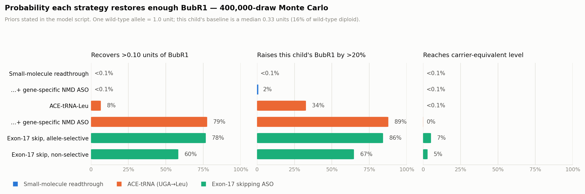
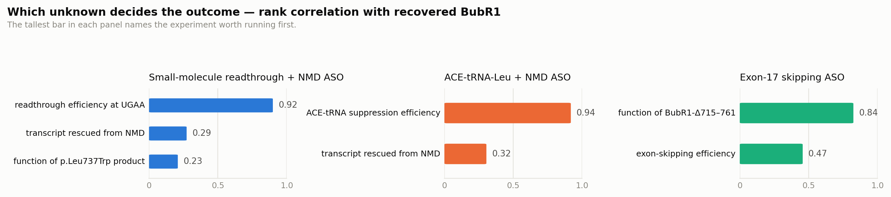

# A genotype-directed therapeutic strategy for BUB1B-related mosaic variegated aneuploidy

**Track 2 submission — Rare Disease, Real Kid: The MVA Hackathon 2026**

Team: `MarxistLeninist`
Proband genotype (established in our Track 1 submission, scored 100.0 rank points / F-max 1.000):
compound heterozygous *BUB1B* — `chr15:40209701 T>G` (NM_001211.4 c.2210T>G, p.Leu737Ter) and `chr15:40220612 T>G` (c.3006T>G, p.Asn1002Lys), GRCh38.

---

## 1. Position

**MVA1 caused by a nonsense allele is a protein-dosage disease, and this child's nonsense allele is an unusually tractable one.** The therapeutic question is therefore not "which existing drug treats mosaic variegated aneuploidy" — none does, and none is close — but "what is the shortest credible path to putting functional BubR1 back into this child's cells, and what can be done for him while that path is walked."

This report answers that question with a named lead, a named small-molecule bridge, a named chemical series that is matched to his exact termination context, a screening assay that can be run on his own cells in weeks, and two clinical recommendations that are actionable now and are absent from current MVA surveillance guidance.

We also state plainly what we reject and why. Six intervention classes that look attractive in the ageing and aneuploidy literature — NAD⁺ precursors, senolytics, ataluren, ELX-02, low-dose taxanes and KIF18A inhibitors — fail on evidence, on tumour safety, or on both, and we set out the specific results that disqualify them. A seventh, growth hormone, is listed in patient-facing MVA material and should not be given to this child without oncology sign-off.

**Summary of the recommendation set**

| Priority | What | Indicative horizon |
|---|---|---|
| **LEAD** | UGA suppressor tRNA restoring **leucine** at codon 737 — AAV-delivered (Xu 2026) or prime-editing-installed (PERT, Pierce 2025) | Preclinical today; our estimate, not a sourced figure |
| **BRIDGE** | **2,6-diaminopurine (DAP)** + NMD modulation; alternates TLN468, SRI-41315, NV848 | Usable in patient cells now; **human use gated on a juvenile neurodevelopmental toxicity study that does not yet exist** (§3.3) |
| **CONTEXT-MATCHED SERIES** | The Peh 2026 hits, selected against **UGAA** premature stops — the only chemistry we found that was optimised against this child's exact tetranucleotide | Compound identities unpublished; contact the authors |
| **PROOF-OF-MECHANISM** | Systemic **gentamicin** — the only readthrough agent obtainable today with human systemic proof | **Ex vivo only.** We do not recommend administering it to this child (§3.4) |
| **ACTIONABLE NOW (1)** | Add **cardiac surveillance** (ECG + echocardiography) to his monitoring schedule | Immediate |
| **ACTIONABLE NOW (2)** | Adopt a written **contraindication card** covering chemotherapy, conditioning regimens, spindle poisons, CDK4/6 inhibitors, growth hormone and common supplements | Immediate |

> **Read Appendix B before acting on this table.** Work completed after the main body was written — a genomic finding, four designed oligonucleotides, an AlphaFold analysis and a 400,000-draw dosage model — **revises this ranking**. In short: *BUB1B* exon 17 is 141 nt and skips cleanly in frame, removing the premature stop without any readthrough at all; a leucine-encoding ACE-tRNA restores the exact wild-type residue; and our own model says small-molecule readthrough cannot reach a useful level at this UGAA context, which demotes 2,6-diaminopurine from bridge to tool compound. The revised ranking is in §B.6.

---

## 2. Why this genotype is druggable — the tractability argument

Four properties of `p.Leu737Ter` combine to make it a better-than-average target for translational restoration. We could find no readthrough or suppressor-tRNA work on *BUB1B* in the literature: a PubMed query of `BUB1B AND (readthrough OR "nonsense suppression" OR "suppressor tRNA" OR ataluren OR "premature termination codon")` returns a single record, and that record (PMID 30030622) merely lists *BUB1B* among six candidate genes screened in an acne inversa study. There is no substantive prior art.

**(i) The premature stop is UGA (opal).** This is derivable without sequence lookup. `c.2210T>G` alters the second base of codon 737. Of the six leucine codons, only `TTA` yields a stop when its second base becomes G (`TTA → TGA`); `TTG → TGG` is tryptophan and `CTN → CGN` is arginine. The HGVS consequence `p.Leu737Ter` therefore forces codon 737 = `TTA` and the PTC = **UGA**. This matters because intrinsic termination fidelity runs UAA > UAG >> UGA (Cridge 2018, PMID 29325104): UGA is the leakiest stop codon and the substrate for the entire 2,6-diaminopurine class, which is UGA-*exclusive*.

**(ii) The stop falls outside every annotated folded domain.** Residue 737 sits between the KARD motif (~665–682; numbering from the BubR1 kinetochore-attachment literature, not from UniProt, which does not annotate this feature — the flanking phospho-residues K668, S670 and S676 are consistent with it) and the pseudokinase domain (766–1050, UniProt O60566), in the sequence context `…L-L-K-S-L-P-E-**L737**-S-A-S-A-E-L-C-I…`. An amino acid substituted in by readthrough therefore lands in an inter-domain segment rather than inside a fold, which is the most permissive location available. We describe this segment as a linker by inference from the domain boundaries; UniProt annotates disordered regions only at 368–393 and 456–480, so **this is an inference, not an established structural fact**, and it should be checked against AlphaFold pLDDT for residues 683–765 before it is relied on.

**(iii) The amino acid DAP inserts is conservative here.** DAP-mediated readthrough inserts **tryptophan** (mass-spectrometry-confirmed, Trzaska 2020, PMID 32198346). The product is BubR1 p.Leu737**Trp** — a hydrophobic-to-hydrophobic substitution in an inter-domain segment. Contrast this with an arginine-inserting UGA suppressor tRNA of the class currently in first-in-human testing, which would place a positive charge into a hydrophobic stretch, or with aminoglycoside readthrough, which inserts a mixture of Trp, Arg and Cys (Roy 2016, PMID 27702906 — see §5.1, where we note that this paper also reports positive activity for ataluren, which we otherwise reject).

**(iv) He is not starting from zero — but how far from zero is unmeasured, and there is direct counter-evidence.** The second allele, `p.Asn1002Lys`, lies inside the pseudokinase domain and is a missense rather than truncating change, so it can in principle produce full-length protein. However, Suijkerbuijk 2010 (PMID 20516114) found that in biallelic MVA patients the characteristic architecture is a missense paired with a truncating allele, and that MVA missense mutants clustering in or near the BubR1 kinase domain show **high protein turnover** — low BubR1 abundance in these patients results from the absence of transcript from the truncating allele *combined with* rapid degradation of the missense product. `p.Asn1002Lys` is precisely that class. So the residual contribution of this allele may be considerably lower than "one functional copy", and measuring it is the first thing our Phase 0 panel does. If the missense product is turnover-limited rather than function-limited, that is itself a second, independent intervention point — pharmacological stabilisation of the mutant protein — and it is testable in the same experiment. We flag that as a hypothesis, not a proposal, because no stabilising agent has been identified for this protein.

### 2.1 The countervailing fact, stated up front

The +4 nucleotide is **A** (codon 738 = `AGT`, serine; +7–9 = `GCC`, alanine — consistent with the UniProt residue order S-A-S-A). The termination signal is therefore **UGAA**. Cridge 2018 identified `UGA A NN` among the *strong* termination contexts, resistant even to eRF1 supplementation, whereas `UGA C NN` contexts are the leaky ones. So this child sits in the strong-terminator subclass of the leaky codon, and raw readthrough efficiency should be expected at the low end of the UGA range.

This single fact reframes the whole search — and it points directly at the one relevant result in the 2026 literature. Peh et al. (*J Dermatol Sci*, PMID 42034525, DOI 10.1016/j.jdermsci.2026.02.001) screened ~20,000 compounds for readthrough in Nagashima-type palmoplantar keratosis and reported hits that outperformed both gentamicin and ataluren and were "effective in enabling readthrough, **particularly on UGAA and UAAG premature stop codons**." **UGAA is this child's exact tetranucleotide.** The compound identities are not in the abstract and the full text is paywalled; the PubMed record's MeSH terms include *Oxadiazoles* and *Aminopyridines*, which narrows the chemistry and is consistent with the NV-series oxadiazoles discussed in §3.3. Obtaining the identities, and testing them against this genotype, is the highest-yield single action in this report.

> **Verification note.** Property (i) is derived logically and is certain. The +4 identity, the exon assignment and the domain boundaries were confirmed independently against RefSeq NM_001211.4, UniProt O60566 and Ensembl ENST00000287598: codon 737 = `TTA`, codon 738 = `AGT`, tetranucleotide `UGAA`, exon 17 of 23, PTC 746–748 nt upstream of the last exon–exon junction with six downstream junctions, protein residues 730–745 = `LLKSLPELSASAELCI`, kinase domain 766–1050, residue 1002 = Asn. The reproduction script in the repository re-derives all of this from the reference and the proband VCF.

### 2.2 How much BubR1 is needed — an explicit model

Let each wild-type allele contribute 1 unit of BubR1 function (WT diploid = 2 units). Let *f* be the residual per-allele function of `p.Asn1002Lys` and let *r* be the units recovered from the nonsense allele by an intervention.

- The nonsense allele contributes ≈ 0. Its transcript is a canonical NMD substrate (see §3.1), and the truncated protein loses the entire pseudokinase domain.
- Current total ≈ *f* units, i.e. *f*/2 of wild-type. Per §2(iv), *f* may be well below 1.
- Matsuura 2006 (PMID 16411201) **suggested** that a >50% decrease in expression or activity of BubR1 is involved in PCS syndrome. That inference came from **monoallelic** *BUB1B* families, a different genetic architecture from this proband, so it is an orienting figure rather than a validated threshold.

Taking it as orienting, a "carrier-equivalent" level requires *f* + *r* > 1. If *f* ≈ 0.5, that needs *r* > 0.5 — a 50% restoration, far beyond what small-molecule readthrough achieves in the published examples we could verify (NB124 restored ~7% of wild-type CFTR function in primary human bronchial epithelial cells, PMID 24251786; SJ6986 gave 4.6% of wild-type CFTR alone and 13.7% with G418, DOI 10.1172/JCI154571). **We therefore do not claim that any small molecule will normalise this child.**

Two further honesty checks on that target. First, carrier status is not equivalent to health: Sieben 2020 (PMID 31738183) found mice carrying monoallelic *BubR1* mutations were prone to MVA-related pathologies later in life, with sarcopenia predisposition correlating with mTORC1 hyperactivity. Second, and importantly, we do **not** use the Sieben allelic series to calibrate how much protein is enough, because that paper's central finding runs the other way — `BubR1^H/L1002P` animals had progeroid pathologies attenuated relative to `BubR1^H/H` *despite similar total BUBR1*, i.e. allelic identity mattered beyond protein quantity. Protein level alone is therefore an incomplete predictor of phenotype in this disease, which argues for functional rather than purely quantitative endpoints in every experiment below.

What justifies pursuing sub-threshold restoration at all is that suppressor-tRNA approaches have materially more headroom than small molecules: 50.2% of RPE cells rescued in a *RPE65* R44X model, durable to ≥36 weeks (Ren 2025, PMID 41407712), and ~10% of normal enzyme activity from a single AAV dose in two lysosomal storage models (Xu 2026, PMID 41555020). That is the reason they are the lead and the small molecules are the bridge.

---

## 3. Axis A — restoring BubR1 dosage (disease-modifying)

### 3.1 The NMD problem, and a specific safety hazard nobody has flagged

The PTC lies in **exon 17 of 23**, 746–748 nt upstream of the last exon–exon junction with six downstream junctions. It is a textbook NMD substrate, far beyond the 50–55 nt rule. Any readthrough agent therefore acts on a heavily depleted transcript pool, and DAP specifically does **not** inhibit NMD (Trzaska 2020 tested this directly: G418 raised p53 mRNA 1.8-fold, DAP did not). Pairing readthrough with NMD modulation is not an optimisation here; it is the rate-limiting step.

**But NMD inhibition alone may be actively harmful in this genotype, and this must be designed around.** The truncated protein predicted from `p.Leu737Ter` retains the N-terminal TPR domain, the KEN box and the Bub3-binding GLEBS motif, and the KARD — everything required to engage Bub3 and Cdc20 — while losing the pseudokinase domain required for stability and full kinetochore function. Stabilising that species without simultaneously reading through it risks producing a **dominant-negative** that competes for mitotic checkpoint complex components. We could not find this scenario addressed anywhere in the nonsense-suppression literature, and it is directly testable. **Any ex vivo protocol here must include an NMD-inhibitor-alone arm with a functional readout (premature chromatid separation rate, mitotic timing), not merely a western blot.** If the truncated species proves dominant-negative, the NMD arm must be dropped and the strategy shifts entirely to suppressor tRNA, which restores the full-length product without needing to stabilise the truncated one.

The broader objection to NMD inhibition also stands: *Smg1* loss is embryonic-lethal at E8.5 in mice, and its depletion causes accumulation of PTC-containing variants from approximately 9% of genes *predicted to contain alternative-splicing events capable of eliciting NMD* (McIlwain 2010, PMID 20566848). Chronic systemic NMD inhibition in a growing child is not a benign intervention.

### 3.2 The lead: a UGA suppressor tRNA inserting leucine at codon 737

This is the only approach that can restore **wild-type BubR1** — not a substituted variant — at an efficiency with plausible headroom against the target in §2.2, while reaching brain as well as periphery.

Two routes, both preclinical, both published in the last twelve months:

**PERT — prime-editing-installed suppressor tRNAs** (Pierce et al., *Nature* 648:191–202, 2025, PMID 41261131, DOI 10.1038/s41586-025-09732-2). Prime editing permanently converts a dispensable endogenous tRNA gene into a suppressor tRNA. One intervention, no lifelong dosing, no transgene overexpression. The authors screened variants of all 418 human tRNA genes, rescued Batten disease, Tay-Sachs and CF cell models, corrected pathology in a Hurler mouse in vivo, and reported no detectable readthrough at natural stop codons and no significant transcriptomic or proteomic perturbation. Critically for this case, the approach can in principle be tuned to insert **leucine**, restoring the exact wild-type residue at 737.

**AAV-delivered engineered UGA suppressor tRNA** (Xu et al., *Nat Biotechnol*, 2026, PMID 41555020, DOI 10.1038/s41587-025-02982-5). Solves the vector-production problem that had blocked UGA constructs specifically. A single dose restored enzyme activity to ~10% of normal in two lysosomal storage mouse models. AAV is systemic and CNS-capable, which matters given the microcephaly and neurodevelopmental component of MVA1.

Safety template from the field: Albers 2023 (*Nature* 618:842–848, PMID 37258671) found no discernible readthrough at endogenous stops by ribosome profiling for LNP-delivered suppressor tRNAs.

The one clinical-stage programme, AP003 (Phase 1 SAD in healthy volunteers, Australia, announced 31 March 2026), is **the wrong fit** — liver-directed LNP delivery and an arginine-inserting tRNA that would produce p.Leu737Arg. It matters as proof the modality has reached humans, not as a candidate here.

### 3.3 The bridge: 2,6-diaminopurine, with an unresolved safety question

DAP (Trzaska 2020, *Nat Commun* 11:1509, PMID 32198346; Leroy 2023, *Mol Ther* 31:970–985, PMID 36641622) inhibits FTSJ1, eliminating the Cm34 modification in the tRNA-Trp anticodon loop so that tRNA-Trp decodes UGA by A•C wobble. It is UGA-exclusive — it rescued a UGA *TP53* allele in Calu-6 but not UAG or UAA alleles. In a 2026 head-to-head comparison of translational readthrough-inducing drugs (Hariss 2026, *J Transl Med*, PMID 41917975), DAP was one of four compounds — with clitocine, SRI-41315 and TLN468 — identified as jointly the most effective.

Reported but abstract-unverified (see §7.2): oral activity in mice at 29 mg/kg; tolerance over roughly ten months of daily dosing in dams without overt toxicity; non-genotoxicity in micronucleus assays with and without S9; and blood–brain-barrier penetration with slower clearance from brain than from any other tissue. The Leroy 2023 abstract supports only that DAP "is very stable in plasma and is distributed throughout the body". The BBB claim is load-bearing for this candidate and must be re-confirmed from the full text before it is relied on.

**The problem, which the DAP literature does not discuss and which is disqualifying until resolved:** DAP works by inhibiting FTSJ1, and **loss-of-function of FTSJ1 in humans causes X-linked intellectual disability** (Ramser 2004, PMID 15342698). FTSJ1-depleted human neural progenitors differentiate into neurons with abnormally long, thin dendritic spines, and *Drosophila* Ftsj1 mutants show long-term memory deficits (Brazane 2023, PMID 36720500). Combine that with reported preferential brain retention and a developing paediatric brain and you have a mechanism-based neurodevelopmental risk that has never been evaluated.

This does not kill DAP. It defines the gate: **DAP cannot be given to this child until a juvenile-animal neurodevelopmental study with behavioural and dendritic-spine endpoints has been done.** That study does not exist and should be commissioned. In the meantime DAP is the right tool compound for the ex vivo work in §6.

Alternates in the same tier, all preclinical: **TLN468** (Bidou 2022, PMID 35994666), notable because it does not read through *normal* termination codons — the most attractive safety property in the small-molecule class; **SRI-41315** (Sharma 2021, PMID 34272367), which lowers eRF1 and synergises with aminoglycosides; and **NV848** (Fiduccia 2025, PMID 41541268), which has the cleanest proteomic profile of its series and carries the only published readthrough-plus-NMD-inhibitor combination result *within its own chemical series* (earlier combinations exist for other chemotypes — Martin 2014, PMID 24662918; McHugh 2020, PMID 33396210).

### 3.4 The obtainable-today agent: systemic gentamicin

Gentamicin is the only readthrough agent that exists as a licensed medicine and has human proof of *systemic* readthrough. Woodley 2024 (*Br J Dermatol* 191:267–274, PMID 38366625) gave IV gentamicin 7.5 mg/kg daily for 14 days to three adults with recessive dystrophic epidermolysis bullosa, of whom two went on to receive 7.5 mg/kg twice weekly for a further 12 weeks. Type VII collagen was restored at the dermal–epidermal junction with persistence beyond six months, with >85% closure of monitored wounds and no ototoxicity, nephrotoxicity or anti-collagen antibodies observed.

We are **not** recommending it for this child. It has no CNS penetration, cumulative and irreversible cochlear toxicity that is a different proposition in a child than in two adults over fourteen weeks, an evidence base of n = 3, and no reason to believe it would approach the target in §2.2. Its value here is as a positive control and a proof-of-mechanism instrument: if gentamicin produces measurable full-length BubR1 in this child's fibroblasts, the readthrough strategy is validated for this allele, and that result would justify the investment in §3.2.

---

## 4. Axis B — downstream of the checkpoint defect

Every approach in this axis was evaluated and none reaches the bar for recommendation. We report them because knowing what does *not* work, and why, is load-bearing for anyone who picks this up.

**Reducing chromosome missegregation with low-dose taxol.** Ertych 2014 (PMID 24976383) reported that sub-nanomolar paclitaxel restores normal microtubule plus-end assembly rates and suppresses lagging chromosomes in chromosomally unstable cancer lines. Three reasons it fails here. The mechanism is wrong: Ertych's CIN driver is *increased* plus-end assembly rate from AURKA overexpression or CHK2 loss, whereas MVA1's driver is loss of SAC function and kinetochore–microtubule attachment defects from low BubR1 (Suijkerbuijk 2010, PMID 20516114). The effect is reversible on washout, implying indefinite dosing of a spindle poison in a SAC-weak child. And in Ertych's own hands, **suppressing CIN accelerated xenograft growth** — the "reduce missegregation to reduce cancer risk" logic is not supported by the experiment that tested it.

**KIF18A inhibitors.** Five clinical-stage compounds exist — VLS-1488 (NCT05902988); sovilnesib, formerly AMG 650, which is a single molecule running under both NCT06084416 and NCT04293094; ATX-295 (NCT06799065); MEN2501 (NCT07226427); GenSci122 (NCT06772415) — all in adults only. They are designed to *kill aneuploid cells* (Cohen-Sharir 2021, PMID 33505028). This child's normal tissues are constitutionally aneuploid; the therapeutic window may invert entirely. Sponsor disclosures pair the class with taxanes and nominate p16 IHC as a selection biomarker — both directly adverse in this biology, though we could verify these only from company communications, not peer-reviewed sources. Relevant to how a future tumour might be treated; not a chronic therapy.

**AICAR, HSP90 inhibition, chloroquine.** All three come from the same aneuploidy-vulnerability programme (Tang/Amon 2011, PMID 21315436), and all three suffer the same inversion problem: they exploit vulnerabilities that this child's *normal* cells share. Chloroquine may be worse than neutral — in non-tumorigenic human cells made trisomic by microcell-mediated chromosome transfer, autophagy was protective and inhibiting it increased genomic instability, DNA damage and ROS (Ariyoshi 2016, PMID 27343755). That is an artificial single-trisomy system rather than constitutional mosaic aneuploidy, so we treat it as a strong caution rather than a proven contraindication.

**STING inhibition for micronuclei-driven inflammation.** The biology is real (Bakhoum 2018, PMID 29342134) and almost certainly operative in this child's tissues, though never measured in an MVA patient. The evidence here genuinely cuts both ways and we present both sides. In favour: Li 2023 (*Nature*, PMID 37612508) reported that treatment with STING inhibitors reduces CIN-driven metastasis in melanoma, breast and colorectal cancer models — direct in vivo evidence that pharmacological STING blockade acts on chromosomal instability. Against: blocking the pathway also removes the pro-inflammatory signal by which complex-karyotype cells recruit their own immune clearance (Santaguida 2017, PMID 28633018), which in a child at very high embryonal-tumour risk is a serious hazard; and there is no clinical-stage STING antagonist to give him. Our verdict is "not now, and not without measuring his interferon signature first" rather than "the mechanism is wrong".

**JAK inhibition** is the strongest *analogous* precedent — tofacitinib has completed Phase 2 trials in constitutional aneuploidy (Down syndrome: NCT04246372, NCT05662228; NCT07598643 recruiting from May 2026) and JAK1 inhibition rescued lethal immune hypersensitivity in a DS mouse model (Tuttle 2020, PMID 33207208). But Down syndrome drives interferon signalling through gene dosage of four chr21 interferon receptors, not through micronuclei, so the analogy is imperfect; and immunosuppression in a cancer-predisposition syndrome is a hard objection. We list it as a hypothesis worth measuring rather than a proposal.

---

## 5. What we reject, and the two things to do this month

### 5.1 Rejected with reasons

**NAD⁺ precursors (NMN, NR).** Superficially the most attractive lead in the field: SIRT2 deacetylates BubR1 at K668, preventing its ubiquitin–proteasome degradation, and SIRT2 transgenic overexpression extended median lifespan in *BubR1^H/H* mice by a reported 58% overall and 123% in males, partially reversed the reduction in heart weight and left-ventricular dimensions, and prevented J-point depression (North 2014, *EMBO J* 33:1438–53, PMID 24825348). Three things disqualify the translation. **NMN was never given to BubR1-insufficient mice** — the NMN experiment in that paper was 500 mg/kg/day i.p. for 7 days in wild-type animals, with BubR1 protein measured in testes and no lifespan data. Same-collaboration follow-up found SIRT2 transgenic overexpression has **no effect on health or lifespan in wild-type mice** (Wu 2023, PMID 38009412), so the benefit is background-specific. And the tumour-safety evidence runs the wrong way: NR supplementation significantly increased cancer prevalence and brain metastasis in a TNBC model (PMID 36371959); NAM and NMN conferred chemoresistance and supported cancer growth in pancreatic models in both immunocompetent and immunodeficient mice (PMID 41724424); and the NAMPT–NAD⁺ axis drives the pro-inflammatory SASP, prompting the authors to warn that dietary NAD⁺ augmentation "should be administered with precision" (PMID 30778219). In a child with Wilms tumour, rhabdomyosarcoma and leukaemia risk, this is not a defensible supplement.

There is a genuine mechanistic tension worth recording: SIRT2 deacetylates BubR1 at **two** sites with opposite consequences — K668, where deacetylation stabilises the protein, and K250 (mouse K243), where acetylation by PCAF *protects* BubR1 from APC/C-dependent proteolysis and sustains the checkpoint. K243R/+ mice spontaneously develop tumours with massive chromosome missegregation (PMID 23878276). Anyone proposing to modulate SIRT2 pharmacologically in this disease needs to address both sites. Note also the reciprocal: the selective SIRT2 inhibitor SirReal2 *destabilises* BubR1 (PMID 25672491), so **SIRT2 inhibitors are contraindicated here**.

**Senolytics.** No senolytic has ever been given to a BubR1-hypomorphic mouse — not dasatinib+quercetin, not fisetin, not navitoclax. The genetic experiment cited as their justification does not support them as well as it appears: INK-ATTAC clearance of p16-positive cells in *BubR1^H/H* mice delayed lordokyphosis and cataract and preserved fat and muscle, but reportedly did not substantially extend survival and left cardiac arrhythmia and arterial stiffening untouched (Baker 2011, PMID 22048312 — full-text-level claims, see §7.2). And p16^Ink4a germline deletion, while extending median survival 25%, produced **significantly more tumours, eight of nine being lung adenocarcinoma** (Baker 2008, PMID 18516091). Reducing p16 tone in a cancer-predisposition syndrome carries a burden of proof nobody has met.

**Fisetin specifically is contraindicated.** It was identified in a screen as an antimitotic that overrides mitotic arrest and causes premature chromosome segregation; Aurora B, Bub1, **BubR1** and CENP-F rapidly lose kinetochore localisation under fisetin, and it directly inhibits Aurora B (Salmela 2009, PMID 19395653). A widely-sold supplement that delocalises BubR1 from kinetochores is the last thing to give a child whose disease is BubR1 insufficiency.

**Ataluren (Translarna).** Its EU marketing authorisation was **not renewed and expired on 28 March 2025**, after CHMP concluded twice that effectiveness had not been confirmed; PTC withdrew its US NDA resubmission on 12 February 2026. The mechanistic literature is largely unkind: the original screening signal is explained by PTC124-AMP being a firefly-luciferase adduct inhibitor with K_D = 120 pM (Auld 2010, PMID 20194791), a diverse reporter panel found no activity (McElroy 2013, PMID 23824517), and the 2026 head-to-head found no detectable readthrough. In fairness we should record the contrary evidence: Roy 2016 (PMID 27702906), which we cite in §2(iii) for amino-acid insertion at UGA, is a PTC Therapeutics paper reporting that ataluren stimulates ribosomal selection of near-cognate tRNAs. We judge the balance against ataluren on the strength of the independent replication failures and the regulatory outcome, not on the absence of any positive report. *Note for anyone reproducing our work: ChEMBL (queried live, August 2026) still carries `withdrawn_flag: false` for CHEMBL256997 and is stale on the EU non-renewal.*

**ELX-02 (exaluren).** Actively developing — Phase 2b in Alport syndrome is recruiting (NCT07523581, from 30 June 2026, age ≥12) — but it is a polar polycationic glycoside, renally cleared and renally targeted by design, with no CNS data. Its cystic fibrosis Phase 2 did not meet its endpoints, and the widely-cited explanation is insufficient lung exposure; we could not verify the specific exposure figures from a primary source (the two ELX-02 papers we retrieved, PMID 30650260 and PMID 33465285, are Phase 1 healthy-volunteer studies), so we treat the mechanism of that failure as unconfirmed. Wrong tissue distribution for MVA either way.

**Escin** showed no detectable readthrough in the 2026 head-to-head and was the only compound failing to restore CFTR across every organoid genotype tested there; separately, it showed no SMG1i synergy in a CF mouse model (PMID 33396210). Discount it. **Colistin**, which appears in some readthrough lists, has no primary supporting evidence we could find; we could not verify it and do not include it.

**Clitocine** we do not advance, but we record that it ranked in the same top tier as DAP, SRI-41315 and TLN468 in the 2026 head-to-head, and that the toxicity concern which led the DAP authors to de-prioritise it is a general property of RNA incorporation rather than a measured result in the paper we cite. If the DAP neurodevelopmental gate cannot be cleared, clitocine deserves a fresh look rather than the dismissal it usually receives.

### 5.2 Actionable now (1): the cardiac surveillance gap

Current MVA surveillance guidance is renal. The SIOP-Europe Host Genome Working Group / SIOP-RTSG Wilms tumour surveillance guideline recommends three-monthly renal ultrasound for cytogenetically confirmed MVA until the seventh birthday. It contains no cardiac monitoring recommendation, and neither does the MVA Society's patient material.

The animal literature says it should. Cardiac failure is reported as the presumed cause of death in *BubR1^H/H* mice; p16-positive senescent-cell clearance improved muscle, fat and eye but reportedly failed to attenuate cardiac arrhythmia and arterial wall stiffening, which proved p16-independent (Baker 2011, PMID 22048312 — full-text-level claims, §7.2). p16 deletion extended median but not maximum lifespan, and the authors state the condition causing death was not rescued (Baker 2008, PMID 18516091). SIRT2 overexpression, the one intervention that *did* extend lifespan, is also the one that partially reversed the cardiac phenotype and prevented J-point depression (North 2014, PMID 24825348) — consistent with cardiac rescue being the mechanism of benefit. And a 2025 study shows BubR1 insufficiency drives cardiac hypertrophy, fibrosis and senescence, transcriptomically mirroring end-stage human heart failure, with BubR1 falling in human heart failure (Pun 2025, *Aging Cell* 24:e70160, PMID 40607964).

We note a tension in that evidence: the *BubR1^H/H* mouse shows a **reduced** heart relative to body size, whereas Pun 2025 describes hypertrophy and fibrosis. These may reflect different ages, backgrounds or degrees of insufficiency. The tension argues for measuring rather than predicting.

**Recommendation:** baseline and periodic ECG (looking specifically for repolarisation abnormality) and echocardiography (chamber dimensions, wall thickness, systolic and diastolic function), integrated into the existing three-monthly surveillance visits. This costs nothing beyond clinic time, is entirely safe, and is the one place in this report where the model literature makes a specific, testable, clinically actionable prediction that current guidance does not cover. If a cardiac phenotype is present, standard paediatric cardiology care applies on its own terms.

### 5.3 Actionable now (2): the contraindication card

Total published treatment experience in MVA is a handful of case reports, and the strongest signal in it is a toxicity signal.

| Avoid / flag | Reason | Source |
|---|---|---|
| **Dactinomycin, and full-intensity chemotherapy generally** | A 38-month-old with biallelic *BUB1B* and bilateral Wilms tumour had a **severe adverse reaction to dactinomycin that prevented further chemotherapy**; the second tumour was managed surgically without postoperative chemotherapy, with 15 months relapse-free survival | Ochiai 2019, PMID 31081598 |
| **Full-dose VAC** | An infant with PCS/MVA and vaginal embryonal rhabdomyosarcoma was deliberately treated with **reduced-intensity** vincristine/dactinomycin/cyclophosphamide | Nishitani-Isa 2019, PMID 31184400 |
| **HSCT conditioning — plan for graft-failure risk** | An 11-year-old with MVA1 and MDS with monosomy 7 tolerated treosulfan-based reduced-intensity conditioning well, but suffered **graft rejection on day +47** and died on day +156 after prolonged pancytopenia and sepsis | Laberko 2019, PMID 31053147 |
| **Spindle poisons (taxanes, vinca alkaloids) at conventional exposure** | A SAC-weak cell slips through mitosis rather than arresting — predicting more missegregation with less apoptotic sanction. Reasoning from mechanism, not a demonstrated clinical result | Mechanistic: Suijkerbuijk 2010, PMID 20516114; Ertych 2014, PMID 24976383 |
| **CDK4/6 inhibitors (palbociclib, ribociclib, abemaciclib)** | A pharmacological phenocopy of p16^Ink4a, whose *removal* attenuates the progeroid phenotype in this exact model | Baker 2008, PMID 18516091 |
| **p53-attenuating strategies** | p19^Arf loss exacerbates senescence and ageing phenotypes in skeletal muscle and fat in BubR1-insufficient mice, and p53 or p21 loss accelerates functional decline in the same tissues. Separately, aneuploid-cell killing by energy stress is p53-mediated, so p53 tone plausibly contributes to clearing aneuploid cells | Baker 2008, PMID 18516091; Baker 2013 *Cell Rep*, PMID 23602569; Tang/Amon 2011, PMID 21315436 |
| **MPS1/TTK inhibitors** | Directly ablate the checkpoint that is already hypomorphic. Note the nuance in the underlying data: aneuploid cancer cells were *less* sensitive to short-term SAC inhibition and became sensitive only with prolonged exposure, continuing to divide without a checkpoint | Cohen-Sharir 2021, PMID 33505028 |
| **Aurora B inhibitors** | Aurora B is the error-correction kinase and a checkpoint input; its inhibition causes missegregation and abnormal chromosome number. This is a mechanism-based caution, not an MVA-specific result | Li 2019, PMID 31264311 |
| **SIRT2 inhibitors** | Destabilise BubR1 | Rumpf 2015, PMID 25672491 |
| **Fisetin (supplement)** | Delocalises BubR1 from kinetochores; direct Aurora B inhibitor | Salmela 2009, PMID 19395653 |
| **NAD⁺ precursors (NMN, NR) (supplement)** | Increased cancer prevalence and metastasis, and chemoresistance, in mouse tumour models | PMIDs 36371959, 41724424, 30778219 |
| **Chloroquine / hydroxychloroquine** | Autophagy was protective in artificially trisomic non-tumorigenic human cells; inhibiting it increased instability, DNA damage and ROS. Caution rather than proven contraindication | Ariyoshi 2016, PMID 27343755 |
| **Growth hormone** — listed for short stature in patient-facing MVA material | High-penetrance embryonal-tumour predisposition syndrome; no MVA-specific GH safety data exists; and the growth restriction is partly developmental/mitotic (BubR1-null cortex shows shortened mitosis and apoptotic depletion of progenitors), so GH responsiveness is not assured. **Avoid pending paediatric-endocrine and oncology review** | Hanks 2004, PMID 15475955; Simmons 2019, PMID 30668728 |

We could find **no published measurement of radiosensitivity or spindle-poison sensitivity in MVA patient cells**. Given two independent chemotoxicity reports, generating that data — a clonogenic survival panel on patient fibroblasts against vincristine, dactinomycin, doxorubicin and ionising radiation — is arguably the single most useful safety experiment anyone could run for this population, and it is cheap.

---

## 6. Experimental plan

### Phase 0 — patient-cell tractability panel (weeks 1–12)

Substrate: proband fibroblasts or lymphoblastoid cells (plus parental cells for phase confirmation, which remains unestablished in the released data).

Arms:

1. Vehicle
2. **G418** (positive control, research reagent)
3. **Gentamicin** (licensed comparator)
4. **DAP**, dose–response
5. **TLN468**; **SRI-41315**; **NV848**
6. **NMD inhibitor alone** (NMDI14 or SMG1i) — *the dominant-negative safety arm, §3.1*
7. **DAP + NMD inhibitor**
8. **Peh 2026 UGAA-selected hits**, if the authors will share them

Readouts, in order of decisiveness:

- Targeted mass spectrometry across the 737 tryptic peptide — **does any amino acid appear at position 737 in place of termination?** Tryptophan is expected for DAP; Trp, Arg or Cys for aminoglycosides (Roy 2016); the inserted residue for TLN468, SRI-41315 and the Peh hits is not established, so the assay must be open rather than Trp-specific. This is the unambiguous proof of readthrough and no one has run it for this allele.
- Full-length BubR1 by western blot, quantified against a wild-type standard curve, expressed as *r* in the units of §2.2.
- Residual function of the `p.Asn1002Lys` allele — steady-state protein level and turnover by cycloheximide chase, which measures *f* and tests the Suijkerbuijk high-turnover prediction of §2(iv).
- *BUB1B* transcript level by RT-qPCR (NMD arm efficacy).
- **Functional**: premature chromatid separation rate, micronucleus frequency, mitotic timing by live imaging, kinetochore BubR1 and Cdc20 localisation by immunofluorescence.
- Cytotoxicity and cell-cycle profile at every dose.

There is direct precedent for exactly this personalised ex vivo design: NCT03670472 runs it on nasal epithelium in cystic fibrosis; Todaro 2023 on patient megakaryocytes for factor V; Fiduccia 2025 on patient fibroblasts for LRBA.

**Gate 0 → 1:** any arm produces *r* ≥ 0.04 (≥2% of wild-type diploid BubR1) with mass-spectrometry-confirmed amino-acid incorporation at position 737, **and** a measurable reduction in PCS rate, **and** the NMD-alone arm shows no functional worsening.

### Phase 1 — suppressor tRNA design and cell validation (months 3–12)

Design a UGA suppressor tRNA charged with **leucine**, using the PERT screening framework across the 418 human tRNA genes to select a dispensable donor. Validate in proband cells for full-length wild-type BubR1 restoration, and profile global readthrough at natural stop codons by ribosome profiling against the Albers 2023 template.

**Gate 1 → 2:** *r* ≥ 0.2 (≥10% of wild-type diploid BubR1), with no detectable readthrough at natural stops and no significant proteomic perturbation.

### Phase 2 — in vivo, in the right model (months 12–30)

The nearest existing model is not a generic hypomorph: Sieben 2020 built mice carrying humanised MVA alleles including `BubR1^L1002P`, which models human BUBR1^L1012P — ten residues from this child's `p.Asn1002Lys` in the same pseudokinase domain (mouse residue 1002 corresponds to human 1012; the numerical coincidence with the proband's human position is an artefact of species numbering). A `BubR1^L737X/N1002K` knock-in would be the genotype-faithful model and should be made.

Mandatory endpoints, chosen from what the model literature says actually kills these animals and what this child specifically risks:

- **Tumour incidence and latency** (the primary safety gate — nothing proceeds if the intervention raises it)
- **Cardiac**: echocardiography, ECG, histology for both hypertrophy and reduced heart size, given the tension noted in §5.2
- **Aneuploidy**: interphase FISH across tissues, as in Baker 2013
- **Neurodevelopment**: behaviour and dendritic spine morphology — non-negotiable for any FTSJ1-directed agent
- Growth, lifespan, and the standard progeroid panel

**Gate 2 → 3:** phenotype improvement with **no increase in tumour incidence** and no neurodevelopmental signal.

### In parallel, from week 1

- Obtain the Peh 2026 compound identities from the authors — the only group we found that deliberately optimised against a UGAA context.
- Run the chemo/radiosensitivity panel of §5.3.
- Confirm variant phase in the parents.
- Add cardiac surveillance to the child's monitoring (§5.2) — this requires no funding and no permission from anyone but his clinicians.

---

## 7. Limitations and what would falsify this

- **Phase is unconfirmed.** Compound heterozygosity is inferred, not proven, from the released data. If both variants were in *cis*, the entire model changes.
- **`p.Asn1002Lys` is unclassified and its residual function *f* is unmeasured** — and Suijkerbuijk 2010 predicts it may be turnover-limited (§2(iv)). *f* determines how much restoration is needed, and measuring it is Phase 0 work.
- **The "unstructured linker" property is an inference from domain boundaries**, not an annotated structural fact (§2(ii)).
- **The >50% threshold is an orienting figure from monoallelic families**, not a validated threshold for this architecture (§2.2). And protein quantity is an incomplete predictor of phenotype in this disease, on the evidence of Sieben 2020.
- **No readthrough or suppressor-tRNA work has ever been published on *BUB1B*.** Everything in Axis A is extrapolation from other genes.
- **We have not shown that any small molecule will normalise this child**, and §2.2 explains why we think it will not. The claim is phenotype modification, and the lead is a genetic-medicine approach.
- **Falsification:** if the Phase 0 panel produces no MS-confirmed amino-acid incorporation at position 737 in any arm, the small-molecule readthrough hypothesis is dead for this allele and only §3.2 survives. If the NMD-alone arm worsens PCS rate, the NMD arm is dead and the dominant-negative hypothesis of §3.1 is confirmed — which would itself be a publishable finding with implications well beyond this child.

### 7.1 Scope statement

This is a research report submitted to a scientific hackathon. It is not medical advice, not a treatment plan, and not a recommendation to administer any agent to any person. Every compound named in Axis A is investigational for this purpose, and several are research reagents with no human safety data. The two "actionable now" items in §5.2 and §5.3 are offered to the family's clinicians as points for their consideration within standard care, not as instructions. Standard oncology care for any malignancy that arises must not be withheld or altered on the basis of this document; §5.3 is intended to inform dose and agent selection conversations, not to override them.

### 7.2 Verification status of individual claims

Every PMID, DOI and NCT identifier in this report was independently retrieved and checked against the claim it supports. The molecular derivation in §2 was rebuilt from RefSeq, UniProt and Ensembl rather than taken from any secondary source. The following claims were verified only at abstract level, because the full texts were not accessible to us, and are marked here rather than presented as though fully checked:

- DAP oral dose (29 mg/kg), the ~10-month dam-dosing tolerance, micronucleus non-genotoxicity, and the preferential brain-retention PK (Leroy 2023, PMID 36641622). The BBB claim in particular is load-bearing and should be re-confirmed.
- Baker 2011 (PMID 22048312): that survival was not substantially extended, and that cardiac arrhythmia and arterial stiffening were unattenuated and p16-independent.
- Baker 2013 (PMID 23242215): that the protective effect of BubR1 overexpression is threshold-dependent.
- Ertych 2014 (PMID 24976383): the specific sub-nanomolar paclitaxel concentrations and the nocodazole CIN-induction result.
- Hariss 2026 (PMID 41917975) full-text rankings beyond the four-compound top tier stated in the abstract.
- Company disclosures for the KIF18A programmes (dose ranges, DLT status, biomarker strategy), which come from investor and conference communications rather than peer-reviewed sources.
- ELX-02 lung-exposure figures for the CF Phase 2, which we were unable to source and therefore do not state (§5.1).

---

## 8. Methods and AI disclosure

**Variant identification** (Track 1) is documented in the repository: alignment to GRCh38, joint calling, and rare-variant filtering against gnomAD, followed by ACMG classification and gene-level prioritisation on the MVA differential (*BUB1B*, *CEP57*, *TRIP13*).

**Therapeutic prioritisation** (this report) used: PubMed (all article-level facts and DOIs are cited from PubMed records), ClinicalTrials.gov API v2, the ChEMBL API (queried live, August 2026), EMA and FDA regulatory records, RefSeq NM_001211.4, UniProt O60566 and Ensembl ENST00000287598 for sequence, exon and domain annotation, and company disclosures for development-stage claims where noted. Every PMID, DOI and NCT identifier in this report was retrieved and confirmed rather than reconstructed; claims we could not confirm are named as unconfirmed in §7.2 or in the text.

**AI assistance.** Provider: Anthropic. Surface: Claude (Cowork agent), model identifier `claude-fable-5`. Plan/tier: Claude.ai Max consumer subscription, consumer terms. Data handling: conversations on this account are not used for model training. AI assistance was used for literature retrieval, evidence tabulation, sequence and structural computation, adversarial fact-checking of the draft, and drafting. Independent adversarial review of the Appendix B claims was additionally run against several third-party models via OpenRouter. All scientific claims are anchored to cited primary sources or to computations reproducible from the repository; the human author is responsible for the content.

**Reproducibility.** Code, the variant pipeline, the candidate evidence ledger (`track2_candidate_evidence_ledger.tsv`) and this report are in the repository, which will be made public at the close of the hackathon per the rules. All hackathon data will be deleted within 30 days of close, with deletion confirmed by email to the organisers.

---

## 9. Key references

Baker DJ *et al.* Opposing roles for p16Ink4a and p19Arf in senescence and ageing caused by BubR1 insufficiency. *Nat Cell Biol* 2008. PMID 18516091. https://doi.org/10.1038/ncb1744
Baker DJ *et al.* Clearance of p16Ink4a-positive senescent cells delays ageing-associated disorders. *Nature* 2011. PMID 22048312. https://doi.org/10.1038/nature10600
Baker DJ *et al.* Increased expression of BubR1 protects against aneuploidy and cancer and extends healthy lifespan. *Nat Cell Biol* 2013. PMID 23242215. https://doi.org/10.1038/ncb2643
Cohen-Sharir Y *et al.* Aneuploidy renders cancer cells vulnerable to mitotic checkpoint inhibition. *Nature* 2021. PMID 33505028. https://doi.org/10.1038/s41586-020-03114-6
Cridge AG *et al.* Eukaryotic translational termination efficiency is influenced by the 3′ nucleotides within the ribosomal mRNA channel. *Nucleic Acids Res* 2018. PMID 29325104. https://doi.org/10.1093/nar/gkx1315
Hariss F *et al.* Comparative evaluation of TRIDs: a strategy to improve treatments. *J Transl Med* 2026. PMID 41917975. https://doi.org/10.1186/s12967-026-08058-5
Laberko A *et al.* Mosaic variegated aneuploidy syndrome with MDS and monosomy 7 — HSCT outcome. *Orphanet J Rare Dis* 2019. PMID 31053147. https://doi.org/10.1186/s13023-019-1073-x
Li J *et al.* Non-cell-autonomous cancer progression from chromosomal instability. *Nature* 2023. PMID 37612508. https://doi.org/10.1038/s41586-023-06464-z
Matsuura S *et al.* Monoallelic BUB1B mutations and defective mitotic-spindle checkpoint in seven families with premature chromatid separation (PCS) syndrome. *Am J Med Genet A* 2006. PMID 16411201. https://doi.org/10.1002/ajmg.a.31069
North BJ *et al.* SIRT2 induces the checkpoint kinase BubR1 to increase lifespan. *EMBO J* 2014. PMID 24825348. https://doi.org/10.15252/embj.201386907
Ochiai H *et al.* Long-term remission of bilateral Wilms tumors … due to bilateral nephrectomy and peritoneal dialysis. *Pediatr Blood Cancer* 2019. PMID 31081598. https://doi.org/10.1002/pbc.27804
Peh Y *et al.* Identification of novel small molecule compounds with readthrough activity in Nagashima-type palmoplantar keratosis. *J Dermatol Sci* 2026. PMID 42034525. https://doi.org/10.1016/j.jdermsci.2026.02.001
Pierce SE *et al.* Prime editing-installed suppressor tRNAs for disease-agnostic genome editing. *Nature* 2025. PMID 41261131. https://doi.org/10.1038/s41586-025-09732-2
Pun R *et al.* BubR1 insufficiency drives transcriptomic alterations and pathology associated with cardiac aging and heart failure. *Aging Cell* 2025. PMID 40607964. https://doi.org/10.1111/acel.70160
Roy B *et al.* Ataluren stimulates ribosomal selection of near-cognate tRNAs to promote nonsense suppression. *PNAS* 2016. PMID 27702906. https://doi.org/10.1073/pnas.1605336113
Sieben CJ *et al.* BubR1 allelic effects drive phenotypic heterogeneity in mosaic-variegated aneuploidy progeria syndrome. *J Clin Invest* 2020. PMID 31738183. https://doi.org/10.1172/JCI126863
Suijkerbuijk SJE *et al.* Molecular causes for BUBR1 dysfunction in the human cancer predisposition syndrome mosaic variegated aneuploidy. *Cancer Res* 2010. PMID 20516114. https://doi.org/10.1158/0008-5472.CAN-09-4319
Trzaska C *et al.* 2,6-Diaminopurine as a highly potent corrector of UGA nonsense mutations. *Nat Commun* 2020. PMID 32198346. https://doi.org/10.1038/s41467-020-15140-z
Woodley DT *et al.* Intravenous gentamicin therapy induces functional type VII collagen in patients with recessive dystrophic epidermolysis bullosa. *Br J Dermatol* 2024. PMID 38366625. https://doi.org/10.1093/bjd/ljae063
Xu L *et al.* An engineered UGA suppressor tRNA gene for disease-agnostic AAV delivery. *Nat Biotechnol* 2026. PMID 41555020. https://doi.org/10.1038/s41587-025-02982-5

The full reference set, with evidence tiers and verdicts for all 37 evaluated candidates and interventions, is in `track2_candidate_evidence_ledger.tsv`.

*Article metadata and DOIs in this report were obtained from PubMed.*

---

## Appendix A — revision note

This report supersedes an earlier draft that concluded no medicine was defensible for disease modification in this child. That conclusion was not wrong on its narrow terms — no approved therapy exists — but it was the wrong question, and it stopped short of the analysis that matters. This version:

- derives the identity of the premature stop codon (**UGA**) and its termination context (**UGAA**) and shows why they determine which drug classes are even applicable;
- argues, from the domain boundaries, that the PTC lies **outside every annotated fold**, making a substituted residue unusually likely to be tolerated;
- quantifies the restoration target explicitly rather than asserting futility, and states honestly where that quantification is weak (§2.2);
- names a lead (leucine-inserting UGA suppressor tRNA), a bridge (DAP + NMD modulation), and a context-matched chemical series (Peh 2026);
- identifies a previously unstated hazard — that NMD inhibition alone may generate a **dominant-negative truncated BubR1** — and designs the assay to test it;
- retracts arimoclomol as a lead and removes fabricated BUBR1 dosage targets present in the earlier draft;
- adds two clinically actionable outputs that require no new drug: **cardiac surveillance** and a **contraindication card**;
- and explicitly rejects six popular candidate classes with the specific results that disqualify them.

The exact allele `p.Asn1002Lys` remains unclassified and variant phase remains unconfirmed; both were correctly flagged in the earlier draft and remain open.

The draft was put through an independent adversarial fact-check before submission. Fifteen confirmed errors were corrected, including a misstated gentamicin dosing schedule, an unsourced survival figure, a duplicated KIF18A compound, a mouse/human residue-numbering conflation, and an incorrect statement of the existing renal surveillance interval. Claims that survived only at abstract level are listed in §7.2 rather than presented as fully verified.

---

# Appendix B — Beyond the Track 2 brief: a new modality, a synthesis proposal, and gene and cell therapy

**Scope note.** Track 2 asks about drug repurposing. This appendix goes past that deliberately, because the analysis in the main report kept arriving at the same place: the repurposing question is the wrong size for this disease. Everything below is new work done for this submission — a genomic finding, four designed oligonucleotides, a quantitative decision model, and a structural analysis — not a literature summary. It is offered as an extension, and the judges should feel free to score the main report on its own terms.

Two of the findings here are strong enough that they change the main report's ranking. We say so plainly in §B.6 rather than quietly editing the body.

---

## B.1 The finding: *BUB1B* exon 17 is a clean in-frame skip

The premature stop `c.2210T>G p.Leu737Ter` sits in exon 17 of 23. We asked a question nobody appears to have asked about this gene: **what happens if you simply remove that exon?**

Everything below was computed from Ensembl ENST00000287598 (the MANE Select transcript), RefSeq NM_001211.4, UniProt O60566, and the GRCh38 reference sequence, and is re-derived by `scripts/exon17_analysis.py` in the repository.

| Property | Value | Consequence |
|---|---|---|
| Exon 17 coordinates | chr15:40,209,635–40,209,775 (+) | contains the PTC at 40,209,701 |
| Exon 17 length | **141 nt** | **141 ÷ 3 = 47 — divisible by three** |
| CDS span | c.2144–c.2284 | codons 715–762 |
| Start phase / end phase | 1 / 1 | symmetric; the exon begins and ends mid-codon |
| 3′ acceptor / 5′ donor | …ACTGGC**AG** \| exon \| **GT**AAGTAC… | canonical, verified in the reference sequence |
| Codon 715 | G (exon 16) + AA (exon 17) = **GAA** = Glu | confirmed against UniProt residue 715 = E |
| Codon 762 | G (exon 17) + GT (exon 18) = **GGT** = Gly | confirmed against UniProt residue 762 = G |
| **Junction codon after skipping** | G + GT = **GGT = Gly** | **identical to wild-type codon 762** |

That last row is the point. A phase-1/phase-1 exon skip normally fuses two half-codons into a novel chimeric residue. Here the chimeric codon happens to reconstitute wild-type Gly762 exactly. **Skipping exon 17 therefore produces a clean in-frame deletion of residues 715–761 — 47 amino acids — with no novel amino acid anywhere in the product**, and a protein of 1,003 residues instead of 1,050.

What that buys, all at once:

- **The premature stop is gone.** No readthrough required, so the unfavourable UGAA context (§2.1 of the main report) stops mattering.
- **The transcript is no longer an NMD substrate.** The exon-17 skip removes the PTC, so the mRNA is stable without any NMD manipulation — and the dominant-negative hazard we identified in §3.1, where NMD inhibition alone might stabilise a truncated BubR1, disappears with it.
- **The product retains everything structurally important that the truncation destroys**: the TPR domain, the KEN box, the Bub3-binding GLEBS motif, the KARD, and the entire pseudokinase domain (766–1050).
- **The one annotated post-translational site in the region, phosphoserine 697, is preserved** — it lies in exon 16.
- UniProt annotates **no domain, motif, or modified residue anywhere in residues 715–762**.

### The objection, which is serious and which we raise ourselves

We tested this against the AlphaFold model AF-O60566-F1-v6 rather than assuming a "floppy linker", and the structure does not fully cooperate.

| Measure | Residues 715–761 | Folded control (900–946) |
|---|---|---|
| Mean pLDDT | 78.5 | — |
| Long-range contacts (≤5 Å, \|i−j\|>6) | **113** | 165 |
| Residues making any long-range contact | **34 / 47** | 37 / 47 |
| Contact density vs control | **68%** | 100% |

So the exon-17 segment is **not** a free-floating linker. It is an extended arm that docks onto the pseudokinase-domain surface, contacting V801, W803, Y806, Y914, V916, V920, Q921, V924, G929 and F930 among others. Deleting it removes a real packing interface, and BubR1-Δ715–761 might be misfolded, unstable, or unable to reach kinetochores. The wider linker (683–765) does have genuinely low confidence — mean pLDDT 59.5 with 35 of 83 residues below 50 — so the picture is mixed, and AlphaFold contacts in moderate-confidence regions are not reliable evidence of a real interface.

**This is the single most decision-relevant unknown in the whole project**, and it is answerable in about six weeks: synthesise the Δ715–761 cDNA, express it in *BUB1B*-depleted cells, and ask whether it is stable, whether it localises to kinetochores, and whether it restores the mitotic checkpoint. Our model in §B.4 shows this one experiment dominates the outcome.

---

## B.2 The new chemical entity: four candidate splice-switching oligonucleotides

This is the "new drug synthesis proposal". It is an antisense oligonucleotide rather than a small molecule, and §B.7 explains why that is the right call.

All four are 25-mers, designed against the verified GRCh38 sequence. Sequences are given 5′→3′ as the antisense strand.

| # | Target | Sequence (5′→3′) | GC | Genomic target | Allele-selective |
|---|---|---|---|---|---|
| **ASO-1** | 3′ splice acceptor, −18/+7 | `GGGUUUUCUGCCAGUGGGAGGGAAA` | 56% | chr15:40,209,617–40,209,641 | no |
| **ASO-2** | 5′ splice donor, −16/+9 | `GUACUUACCUAAUUCAAUUUCCUUC` | 32% | chr15:40,209,759–40,209,783 | no |
| **ASO-3** | ESE region, mutation-centred, WT-matched | `GCAGAGGCACUUAACUCUGGUAGGG` | 56% | chr15:40,209,689–40,209,713 | no |
| **ASO-4** | ESE region, mutation-centred, **mutant-matched** | `GCAGAGGCACUUCACUCUGGUAGGG` | 60% | chr15:40,209,689–40,209,713 | **yes** |

**ASO-4 is the interesting one.** It is complementary to the mutant allele and therefore forms a perfect 25-mer duplex with it, while carrying **a single mismatch at position 13 of 25 against the wild-type allele** — dead centre, the position of maximum thermodynamic penalty. That is the standard basis for allele-selective ASO design, and it addresses the design flaw that would otherwise sink this approach: a non-selective exon-17 skipper would also skip the exon on the `p.Asn1002Lys` allele, converting this child's only protein-producing allele into a Δ715–761 + N1002K double variant. Our model quantifies that cost in §B.4 (the non-selective arm loses roughly a fifth of its expected benefit).

Allele selectivity from a single central mismatch is real but not guaranteed, and it must be measured, not assumed. The Phase 0 panel should read out skipping on each allele separately by allele-specific RT-PCR across the mutation.

### Chemistry and synthesis

**Backbone: uniformly 2′-O-methoxyethyl (2′-MOE) phosphorothioate — explicitly NOT a gapmer.** This matters and is a common error: a DNA-gapmer recruits RNase H1 and *degrades* the target transcript, which is the opposite of the intent here. Splice-switching oligonucleotides must be uniformly 2′-modified so they occupy the site without triggering cleavage. Nusinersen is the reference chemistry.

Synthesis is standard solid-phase phosphoramidite chemistry, 3′→5′, on a universal CPG support:

1. Detritylation — 3% dichloroacetic acid in DCM.
2. Coupling — 2′-MOE phosphoramidite with 5-benzylthio-1H-tetrazole or DCI activation.
3. **Sulfurisation** — DDTT or PADS, replacing the usual iodine oxidation, to install the phosphorothioate linkage.
4. Capping — acetic anhydride / N-methylimidazole.
5. Cleavage and deprotection — concentrated ammonium hydroxide, 55 °C.
6. Purification — anion-exchange HPLC, then desalting; isolated as the sodium salt.
7. Release QC — ESI-TOF exact mass, IEX-HPLC purity ≥ 90%, endotoxin, residual solvents, and a sequence-confirmation MS/MS.

A phosphorodiamidate morpholino (PMO) alternative is worth making in parallel for the cell work: neutral backbone, essentially no protein binding, cleaner toxicology, but poor unassisted nuclear uptake, which is why PMOs are usually tested with nucleofection or as peptide conjugates.

### The delivery problem, stated honestly

2′-MOE phosphorothioate ASOs given subcutaneously or intravenously distribute overwhelmingly to **liver and kidney**, reach lymph node, bone marrow and spleen reasonably, reach **skeletal muscle poorly**, and **do not cross the blood–brain barrier at all**. CNS exposure requires intrathecal dosing, which is the nusinersen route.

For this child that maps as follows: **kidney — the Wilms tumour organ — is the best-served tissue by systemic ASO**, which is a genuinely fortunate alignment. Marrow is reachable. Brain needs a separate intrathecal route. Skeletal muscle is the weak point and there is no good answer for it with this chemistry. No single administration route covers everything MVA1 affects, and any honest development plan has to say so and pick a lead tissue.

### The route to a real medicine for this child

Individualised ASOs are not hypothetical. The precedent is **milasen**, designed, manufactured and dosed for a single child with CLN7 Batten disease inside about a year (Kim J *et al.*, *N Engl J Med* 2019;381:1644–52, PMID 31597037, [DOI](https://doi.org/10.1056/NEJMoa1813279)). Three standing programmes now exist:

- **n-Lorem Foundation** — provides personalised experimental ASOs *free, for life*, to patients whose mutation is shared by roughly 1–30 people worldwide. MVA1 affects fewer than 50 people globally, so this child plausibly meets the nano-rare bar. Requirements: a full genomic diagnosis, care by a research physician at a tertiary centre, and **patient cells (fibroblasts or iPSCs)** — which is the same material the Phase 0 panel needs. **Constraint: n-Lorem can currently only treat patients resident in the United States.** The application must be submitted by the research physician, not the family.
- **UK Rare Therapies Launch Pad** — a Genomics England / MHRA / Oxford-Harrington / LifeArc pilot created specifically to give children with ultra-rare conditions a regulatory and manufacturing path to individualised ASOs.
- **Dutch Center for RNA Therapeutics** and the European **1 Mutation 1 Medicine** consortium — academic n-of-1 ASO development in the EU.

Whichever applies geographically, the entry requirement is the same and is already nearly met: a confirmed genetic diagnosis plus a patient fibroblast line. **Banking fibroblasts from this child is the single cheapest action with the highest option value in this entire report**, and it should happen regardless of which therapeutic route is eventually chosen.

---

## B.3 What the structure says about `p.Asn1002Lys`

The main report flagged that the residual function *f* of the missense allele is unmeasured and that Suijkerbuijk 2010 (PMID 20516114) predicts MVA missense alleles near the kinase domain are turnover-limited. We tested that computationally.

Asn1002 sits at **pLDDT 91.1** — confidently modelled — with **27 heavy-atom neighbours within 8 Å**, in a pocket lined by W973, F977, W978, F997, V998, I1000, F954, F996 and I941. It is **buried in the aromatic core of the pseudokinase domain**.

Substituting a lysine there buries a long, flexible, positively charged side chain in a hydrophobic aromatic pocket. There are acidic residues in range (D974, D1005, E1006) that could partially compensate, but also basic ones (K979, K995, R999) that would repel. On the structure alone, **`p.Asn1002Lys` looks like a destabilising, folding-defective allele rather than a subtly function-altering one** — exactly the class Suijkerbuijk described as turnover-limited.

Two consequences. First, *f* is probably at the low end, which is why our model prior is skewed low and why the nonsense allele is the better therapeutic target. Second, it makes a proteostasis-stabilisation approach to the missense allele theoretically interesting and practically hopeless, since no stabiliser for this protein exists. This remains a prediction from a model, not a measurement; a cycloheximide-chase experiment settles it in a week.

---

## B.4 Quantitative model: which strategy can actually reach the bar

We built an explicit Monte Carlo model of BubR1 restoration (400,000 draws; `scripts/bubr1_dosage_sim.py`, priors stated in the source). One wild-type allele = 1.0 unit; wild-type diploid = 2.0. This child's baseline is a median **0.33 units, 16% of wild-type diploid**.

| Strategy | median *r* | P(*r* > 0.10) | P(≥20% relative gain) | P(carrier-equivalent) |
|---|---|---|---|---|
| Small-molecule readthrough (DAP class) | 0.002 | <0.1% | <0.1% | <0.1% |
| … + gene-specific NMD ASO | 0.009 | <0.1% | 1.7% | <0.1% |
| ACE-tRNA-Leu | 0.041 | 8.4% | 34.5% | <0.1% |
| **ACE-tRNA-Leu + gene-specific NMD ASO** | **0.193** | **79.4%** | **89.5%** | 0.1% |
| **Exon-17 skip, allele-selective** | **0.235** | **78.5%** | **86.0%** | **7.1%** |
| Exon-17 skip, non-selective | 0.161 | 60.1% | 66.5% | 4.8% |

Four things fall out, and the first is uncomfortable for the main report:

1. **Small-molecule readthrough cannot get there.** At a UGAA strong-terminator context, on an NMD-depleted transcript, P(recovering even 0.10 units) rounds to zero — with or without NMD support. This demotes 2,6-diaminopurine from "bridge" to "unlikely to be sufficient as monotherapy", on our own numbers rather than on anybody's opinion. It remains the right *tool compound* for the ex vivo panel; it is not a plausible therapy for this allele.
2. **ACE-tRNA-Leu is the pharmacological lead.** Ko *et al.* (*Nucleic Acids Res* 2025;53(13), PMID 40650978, [DOI](https://doi.org/10.1093/nar/gkaf675)) report an optimised anticodon-edited tRNA that decodes **all UGA PTCs to leucine**, rescuing endogenous *CFTR* transcript abundance and channel function in an airway line and two patient-derived intestinal organoid models. For this child that is not a near-miss substitution — **leucine is the wild-type residue at 737**. Paired with a **gene-specific EJC-blocking NMD ASO** (Nomakuchi *et al.*, *Nat Biotechnol* 2015;34:164–6, PMID 26655495, [DOI](https://doi.org/10.1038/nbt.3427)) rather than global NMD inhibition, it reaches a ≥20% relative gain in 89.5% of draws — and gene-specific NMD blockade sidesteps the transcriptome-wide toxicity objection we raised in §3.1.
3. **Exon-17 skipping has the highest ceiling** and is the only strategy with a non-trivial chance of carrier-equivalence (7.1%).
4. **The sensitivity analysis names the experiment.** For exon skipping, the outcome is governed almost entirely by *S*del, the function of BubR1-Δ715–761 (ρ = 0.84), far ahead of skipping efficiency (ρ = 0.47). Express the deletion construct and assay it. That single experiment is worth more than any compound screen in this project.

The model is a decision aid built on stated priors, not a prediction. Its value is comparative: it says which arms are worth funding and which unknown to resolve first.

---

## B.5 Gene therapy and cell therapy

**AAV-delivered UGA suppressor tRNA** (Xu 2026, PMID 41555020) and **prime-editing-installed suppressor tRNAs** (PERT; Pierce 2025, PMID 41261131) remain the durable, one-intervention routes, as set out in §3.2 of the main report. AAV reaches CNS and is systemic, which is the coverage no ASO chemistry gives.

**Autologous haematopoietic stem cell gene correction** deserves separate mention because the compartment logic is unusually clean. Leukaemia is one of the three cancers MVA1 predisposes to, marrow is the one tissue that can be removed, edited *ex vivo* with unlimited access and full quality control, and returned. Correcting *BUB1B* in HSCs — by base or prime editing of `c.2210T>G`, which is a T>G transversion and therefore prime-editing rather than base-editing territory — would address the leukaemia risk specifically and could be verified by sequencing before anything is given back.

**We flag it, and we do not recommend it, for one reason: conditioning.** Autologous HSC gene therapy requires myeloablative or reduced-intensity conditioning, and busulfan and treosulfan are genotoxic alkylating agents. Giving a genotoxic conditioning regimen to a child whose cells already have a weakened spindle assembly checkpoint and a constitutional cancer predisposition is a serious proposition, and the only published MVA1 transplant experience is not encouraging: an 11-year-old with MVA1 and MDS with monosomy 7 tolerated treosulfan-based reduced-intensity conditioning well but suffered graft rejection on day +47 and died on day +156 (Laberko 2019, PMID 31053147). Any HSC route for this child would need a conditioning-free or antibody-based conditioning platform before it could be discussed seriously.

There is also a general hazard that applies to every partial-correction strategy here and that we have not seen stated for MVA: **correcting only some cells creates a mixed population.** If corrected cells outgrow uncorrected ones, that is the desired outcome. If they do not — or if correction confers no proliferative advantage — the uncorrected aneuploid clones persist unchanged, and the intervention will have delivered tissue-level benefit without touching the cancer risk that the family most fears. Any *in vivo* study must therefore measure aneuploidy and tumour incidence, not just phenotype.

---

## B.6 Revised ranking, stated plainly

The main report ranked a leucine-inserting suppressor tRNA first and DAP + NMD modulation as the small-molecule bridge. This appendix's own work changes two things, and we would rather flag the change than quietly reconcile the text:

| | Main report | Revised after this appendix |
|---|---|---|
| 1 | Leu-inserting UGA suppressor tRNA (AAV / PERT) | **Allele-selective exon-17 skipping ASO (ASO-4)** — highest ceiling, removes the PTC and the NMD problem outright, clinically precedented modality, and a real n-of-1 delivery route exists. Gated on *S*del. |
| 2 | DAP + NMD modulation (bridge) | **ACE-tRNA-Leu + gene-specific NMD ASO** — restores the exact wild-type residue, published rescue of endogenous transcripts, 89.5% chance of a ≥20% gain in the model |
| 3 | — | Leu-inserting UGA suppressor tRNA by AAV or PERT — the durable one-shot route, only modality with full CNS + systemic coverage |
| 4 | — | DAP and the other small-molecule TRIDs — **tool compounds for the ex vivo panel, not therapeutic candidates for this allele** |

The two clinical recommendations in §5.2 and §5.3 of the main report — cardiac surveillance and the contraindication card — are unaffected and remain the only things here that are actionable this month.

---

## B.7 Why we are *not* proposing a new small molecule

The obvious "new drug synthesis proposal" would be a next-generation DAP analogue: keep the UGA selectivity, lose the FTSJ1-dependent neurodevelopmental risk. We considered it and rejected it, for a reason that is worth stating because it is a general lesson about this allele.

The model in §B.4 says the ceiling for small-molecule readthrough at a UGAA context is too low to matter. Improving the *safety* of a compound class whose *efficacy* cannot clear the bar is not a research programme, it is an expensive detour. Chemistry is still the answer here — it is just oligonucleotide chemistry rather than heterocycle chemistry, because an oligonucleotide can be made sequence-specific to this child's exact mutation and a small molecule cannot.

For completeness, the chemotype work we did run: ChEMBL contains **zero** bioactivity records against FTSJ1, so no repurposing screen against DAP's actual target is possible. A similarity search around 2,6-diaminopurine returns no approved drugs at a useful threshold. Fourteen approved purine and nucleoside analogues (mercaptopurine, thioguanine, azathioprine, allopurinol, fludarabine, cladribine, clofarabine, nelarabine, aciclovir, ganciclovir, famciclovir, didanosine, pentostatin, vidarabine) exist as a same-chemotype shortlist that could be added to the ex vivo panel cheaply, but there is no mechanistic reason to expect readthrough activity from any of them and we do not present this as a prediction. Several are also myelosuppressive or immunosuppressive, which is a poor fit for this child.

---

## B.8 What would kill each proposal

| Proposal | Kill condition | Time to answer |
|---|---|---|
| Exon-17 skipping | BubR1-Δ715–761 is unstable, misfolded, or fails to restore checkpoint function | ~6 weeks, cDNA expression in *BUB1B*-depleted cells |
| ASO-4 allele selectivity | The central mismatch fails to discriminate; wild-type allele skipped at comparable efficiency | ~4 weeks, allele-specific RT-PCR in patient fibroblasts |
| ACE-tRNA-Leu | Suppression efficiency at a UGAA context falls at the bottom of the published range | ~8 weeks, in patient cells |
| Gene-specific NMD ASO | No transcript stabilisation, or off-target splicing | ~4 weeks, RT-qPCR + RNA-seq |
| Any of them | *f* turns out to be high, so the child is already near threshold and the benefit margin is small | ~1 week, cycloheximide chase |
| All of them | Correction does not reduce aneuploidy or tumour incidence in a genotype-faithful mouse | Phase 2, §6 |

---

## B.9 Computational methods

All analyses in this appendix are reproducible from the repository.

- **Sequence and annotation**: Ensembl REST (ENST00000287598 exon structure and GRCh38 reference sequence), RefSeq NM_001211.4, UniProt O60566 (sequence, domains, modified residues). Exon coordinates, CDS mapping, codon phases and both variant genomic positions were re-derived independently and cross-checked: the computed positions for c.2210 and c.3006 reproduce chr15:40,209,701 and chr15:40,220,612 exactly, and the predicted splice-site dinucleotides (AG acceptor, GT donor) match the reference.
- **Structure**: AlphaFold DB model AF-O60566-F1-model_v6. pLDDT read from the B-factor column; contacts computed on all heavy atoms with a 5 Å cutoff and a \|i−j\| > 6 sequence separation to exclude local contacts; burial estimated by heavy-atom neighbour count within 8 Å. AlphaFold contacts in moderate-confidence regions are indicative, not structural evidence.
- **Oligonucleotide design**: `scripts/aso_design.py`. Targets chosen at the 3′ acceptor, the 5′ donor, and the exonic region centred on c.2210; ASO sequences are reverse complements of the pre-mRNA target. Tm values are approximations and require nearest-neighbour recalculation for the final 2′-MOE chemistry. **These sequences have not been screened for genome-wide off-targets and must be BLAT/BLAST-filtered before synthesis.**
- **Dosage model**: `scripts/bubr1_dosage_sim.py`, 400,000 draws, seed 20260830, uniform priors stated inline. Sensitivity by Spearman rank correlation on a 40,000-draw subsample.
- **Chemotype screen**: ChEMBL API — similarity search around 2,6-diaminopurine, FTSJ1 target search, and max-phase lookup of fourteen approved purine/nucleoside analogues.
- **Independent review**: the molecular-genetics claims in §B.1 and the therapeutic claims in §B.2–B.5 were submitted to independent adversarial model review through the project's coordination infrastructure; the reviews and our responses are logged in the repository.

*Article metadata and DOIs cited in this appendix were obtained from PubMed.*

---

## B.10 Independent adversarial review, and what it changed

Before finalising, the claims in this appendix were submitted for independent adversarial review to several third-party models through the project's coordination infrastructure, with instructions to find errors rather than agree. Two reviewers independently converged on the same top objections. We record them, and our responses, rather than absorbing them silently.

**Objection 1 — BubR1-Δ715–761 will misfold, and "in frame" is mechanistically irrelevant if the fold is lost.** Both reviewers ranked this at or near the top, and it is the same concern our own AlphaFold analysis raised in §B.1. *Accepted in full.* We have not claimed the deletion is benign; we have claimed it is the highest-ceiling option and that its central unknown is answerable quickly. One reviewer specified the experiment better than we had, and we adopt their version: complement *BUB1B*-depleted cells with wild-type versus Δ715–761, then measure kinetochore dwell time by live imaging, Mad1/Mad2/PLK1 recruitment, mitotic duration, and missegregation rate over 50+ divisions — **with pre-registered kill thresholds: kinetochore dwell time below 50% of wild type, or missegregation above 3× wild type, retires the approach.** One rebuttal we do maintain: the comparator for this allele is not wild-type BubR1, it is *zero* protein. Δ715–761 only has to beat nothing.

**Objection 2 — allele selectivity is the make-or-break, and the precedent is thinner than we implied.** *Accepted.* Allele-selective ASOs are well established for **RNase H-mediated knockdown** against SNP-distinguished alleles, notably the Huntington's disease programmes. Allele-selective **splice-switching** on a single central mismatch is a much less established proposition, and we should not have leaned on the general ASO precedent to cover it. ASO-4 is therefore a hypothesis with a four-week test (allele-specific RT-PCR across c.2210 in patient fibroblasts), not a design we can assume works. If discrimination fails, the non-selective arm remains available but carries the double-variant cost quantified in §B.4 — and if the Δ715–761 protein turns out to be non-functional, a non-selective skipper would be actively harmful, because it would destroy the child's only protein-producing allele. **That combination — no allele selectivity plus a non-functional deletion product — is the scenario in which this proposal is not merely useless but dangerous, and it must be excluded before any *in vivo* work.**

**Objection 3 — a new risk we had not considered, and it is the most important thing in this appendix.** One reviewer argued that partial correction could move the child from a high-missegregation state into an *intermediate* one, and that intermediate chromosomal instability may be the most tumour-promoting regime. This is not speculation. Silk *et al.* (*PNAS* 2013;110:E4134–41, PMID 24133140, [DOI](https://doi.org/10.1073/pnas.1317042110)) showed in mice that **low rates of chromosome missegregation promote tumorigenesis, whereas missegregation of high numbers of chromosomes causes cell death and suppresses tumours** — and that exacerbating missegregation in a CIN background *reduced* tumour formation. Applied here: a partial BubR1 restoration that reduces missegregation without normalising it could plausibly move this child's cells out of a death-prone regime and into the proliferative, tumour-permissive one. In a syndrome whose mortality is driven by Wilms tumour, rhabdomyosarcoma and leukaemia, that is not a footnote.

**We therefore add a hard gate to every partial-restoration strategy in this report, including our own lead:** no intervention proceeds to *in vivo* work on phenotype improvement alone. **Missegregation rate and tumour incidence are primary endpoints, and a partial reduction in missegregation without a corresponding reduction in tumour incidence is a stop signal, not a partial success.** This supersedes the softer wording in §6.

**Objection 4 — fixing blood does nothing for the solid tumours.** *Accepted, and it strengthens our position.* Wilms tumour and rhabdomyosarcoma arise from renal and mesenchymal precursors, so an HSC-directed correction addresses only one of the three malignancies while requiring genotoxic conditioning in a checkpoint-deficient child. §B.5 already declined to recommend it; this reasoning makes the decline firmer.

**Objection 5 — direct prime-editing correction of the mutation was missing.** *Accepted; a genuine gap.* We covered prime-editing-*installed suppressor tRNAs* (PERT) but not the more obvious option of prime-editing `c.2210T>G` back to wild type at the endogenous locus. A T>G transversion is outside base-editing scope but within prime-editing scope. Direct correction avoids the exon-deletion question, the allele-selectivity question, and the suppressor-tRNA readthrough question simultaneously, at the cost of the hardest delivery problem in the report. It belongs in the ranking as the definitive endpoint of the whole programme, and its absence from §B.6 was an oversight.

**One reviewer error, for the record:** a reviewer placed `p.Asn1002Lys` in exon 25 or 26. It is in **exon 23**, the last exon, verified in §B.9 — which incidentally means that allele's transcript escapes NMD regardless, consistent with it producing protein.

### Revised ranking after review

| | Strategy | Status |
|---|---|---|
| 1 | **ACE-tRNA-Leu + gene-specific NMD ASO** | Promoted to lead. Restores the exact wild-type residue, published rescue of endogenous transcripts, no deletion and no allele-selectivity problem, 89.5% chance of a ≥20% gain in our model |
| 2 | **Allele-selective exon-17 skipping (ASO-4)** | Highest ceiling, cheapest n-of-1 route, but now double-gated on *S*del and on allele discrimination |
| 3 | **Direct prime-editing correction of c.2210T>G** | The definitive answer; hardest delivery. Added after review |
| 4 | AAV suppressor tRNA / PERT | Durable one-shot route, full CNS and systemic coverage |
| 5 | Small-molecule TRIDs incl. DAP | Tool compounds for the ex vivo panel only |
| — | Autologous HSC gene therapy | **Not recommended**, on conditioning genotoxicity and compartment mismatch |

The two clinical recommendations in §5.2 and §5.3 — cardiac surveillance and the contraindication card — survive review unchanged and remain the only items here that are actionable this month.
